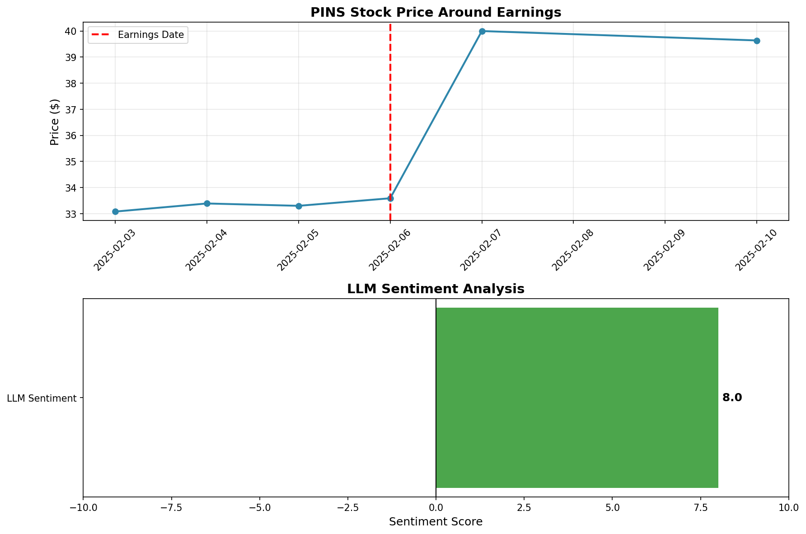

# LLM Earnings Call Analyzer

AI-powered tool that analyzes earnings call transcripts and validates predictions against actual stock price movements.

## 📊 Results

Tested on 4 companies across different sectors:

| Company | Sector | LLM Sentiment | Stock Move | Result |
|---------|--------|---------------|------------|--------|
| **JPMorgan** (JPM) | Banking | +8.0 | +8.04% | ✅ ALIGNED |
| **Pinterest** (PINS) | Social Media | +8.0 | +19.83% | ✅ ALIGNED |
| **Coinbase** (COIN) | Crypto | +8.0 | -10.25% | ❌ MISALIGNED |
| **Datadog** (DDOG) | Cloud SaaS | +8.0 | -10.94% | ❌ MISALIGNED |

**Accuracy: 50% (2/4 predictions)**

### Sample Output



## Key Insights

1. **LLM shows bullish bias** - Rated all companies 8/10
2. **Sector matters** - Traditional sectors more predictable than tech/crypto
3. **Sentiment alone insufficient** - Need market expectations, valuation context

## Features

- Sentiment analysis (-10 to +10 scale)
- Financial metrics extraction (revenue, EPS, guidance)
- Risk factor identification
- Investment recommendations (BUY/HOLD/SELL)
- Stock price validation with visualizations

## Tech Stack

- **Groq API** (Llama 3.3 70B)
- **yfinance** (stock data)
- **matplotlib** (visualizations)
- **Python 3.x**

## Usage
```bash
pip install groq yfinance matplotlib
export GROQ_API_KEY='your-api-key'
python earnings_analyzer_v2_groq.py
```

## Files

- `earnings_analyzer_groq.py` - V1: Basic sentiment analysis
- `earnings_analyzer_v2_groq.py` - V2: With price validation
- `*_transcript.txt` - Earnings transcripts
- `*_earnings_analysis.png` - Results visualizations

## Future Improvements

- Incorporate analyst expectations
- Multi-model ensemble
- Sentiment calibration to reduce bias
- Sector-specific models

---

**Educational project - Not financial advice**

Built as part of quantitative finance learning journey